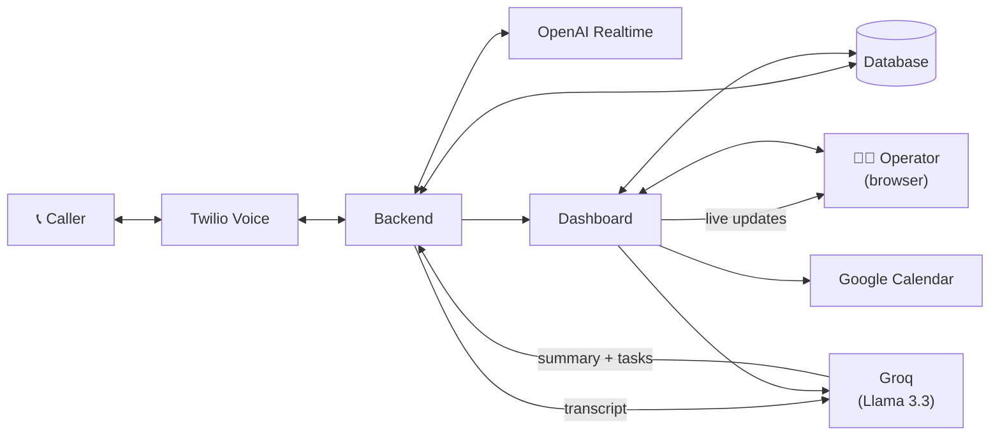

# Architecture

How a call moves through the system, end to end. See [`README.md`](README.md) for
the repo layout and [`GETTING_STARTED.md`](GETTING_STARTED.md) /
[`DEPLOYMENT.md`](DEPLOYMENT.md) for running it.

## The two phases

**1. Live call** — Twilio and the OpenAI Realtime API are bridged for the
whole call: caller audio streams to OpenAI, the model's audio streams back to
the caller, and the model can hang up when done. Each transcribed turn is
saved and broadcast live so the dashboard updates in real time — no polling.

If the caller's number matches an existing customer, their name/address, last
call's problem, and any open tasks are given to the model with an explicit
"confirm, don't re-ask" directive.

**2. Post-call extraction** — once the call ends, the transcript is sent to a
Groq-hosted Llama 3.3 model (kept separate from the live OpenAI session —
cheaper, and it's fine if it's a beat slower) to pull out structured fields:
name, address, problem, urgency, a summary, tags, and to-do items (each
checked for whether it's an appointment, resolved to a real date if given).
That result is saved and shown on the dashboard, which can also re-run
extraction or book a real Google Calendar event.