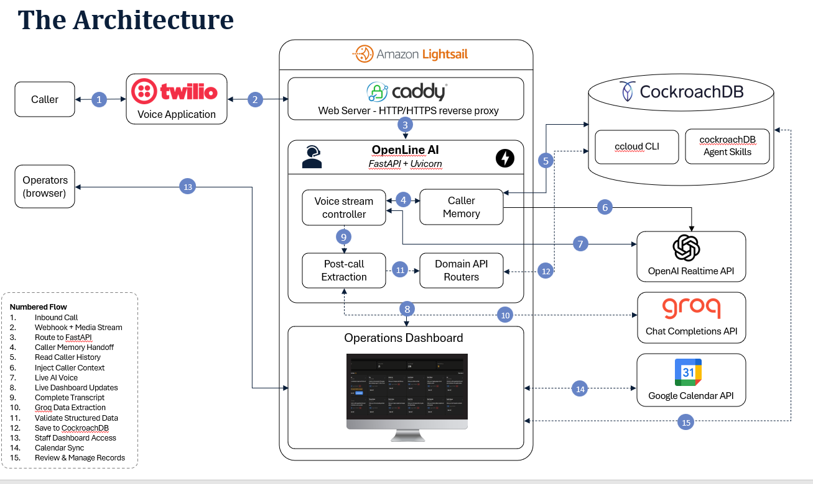

# OpenLine AI — The Front Desk That Never Sleeps

OpenLine AI is a 24/7 AI phone receptionist for service businesses that cannot always stop working to answer the phone. It holds a natural conversation, remembers returning callers, captures every detail, and turns each call into structured follow-up work.

Built for the [CockroachDB × AWS Hackathon — Build with Agentic Memory](https://cockroachdb-ai.devpost.com/).

## Why OpenLine AI

For roofers and other field-service teams, an unanswered call can become a job awarded to the next available contractor. OpenLine AI helps businesses respond immediately without adding another person to every shift.

- **Always available:** answers incoming calls day or night.
- **Natural voice interaction:** supports real-time, two-way conversation and interruption handling.
- **Persistent caller memory:** recognizes returning customers and uses prior context instead of starting over.
- **Live operational visibility:** saves and displays transcript turns while the call is active.
- **Action after the conversation:** extracts service needs, urgency, summaries, and follow-up tasks.
- **One staff workspace:** brings calls, customers, transcripts, tasks, and appointments into one dashboard.

## Product experience

OpenLine AI works in two phases:

### 1. Live call

Twilio routes the incoming call through Caddy to the FastAPI application running on Amazon Lightsail. The voice controller bridges the caller with OpenAI Realtime. When the phone number belongs to an existing customer, CockroachDB supplies their profile, latest call, and open tasks to the model. Every caller and assistant transcript turn is saved and broadcast to the dashboard as the conversation happens.

### 2. Post-call extraction

After the call, Groq converts the completed transcript into structured customer details, service needs, urgency, a summary, tags, and follow-up tasks. FastAPI validates the result and persists it in CockroachDB, where staff can review it, manage the next steps, or schedule an appointment.

## Architecture



The solid arrows show the live-call path. The dotted arrows show post-call extraction and optional staff actions.

## How OpenLine AI Uses CockroachDB

CockroachDB powers OpenLine AI's persistent caller memory and operational records. During a call, each transcript turn is saved immediately. After the call, FastAPI writes the extracted customer details, call summary, and follow-up tasks back to CockroachDB. The dashboard and future calls can then use the same connected context.

The application uses four core tables:

| Table | Role in the product |
| --- | --- |
| `customers` | Stores caller identity and contact information used to recognize returning customers. |
| `calls` | Stores the completed service request, details, urgency, availability, summary, and previous-call relationship. |
| `transcripts` | Stores every caller and assistant turn while the conversation is happening. |
| `tasks` | Stores follow-up work, status, appointment suggestions, scheduled time, and optional calendar event ID. |

Schema migrations live in [`migrations/`](migrations/) and run in filename order.

### How we used CockroachDB tooling and Agent Skills

- **ccloud CLI** gives the team command-line access to CockroachDB Cloud for cluster discovery, connection setup, and development-time inspection without relying only on the web console. The repository includes the CLI used by the team under `ccloud/`.
- **[Designing Application Transactions](https://github.com/cockroachlabs/cockroachdb-skills/tree/main/skills/cockroachdb-application-development/designing-application-transactions)** shaped the completed-call write path. Customer upsert, call insertion, and task creation run inside one database transaction, so the entire unit commits together or rolls back together instead of leaving partial call records.
- **[CockroachDB SQL](https://github.com/cockroachlabs/cockroachdb-skills/tree/main/skills/cockroachdb-query-and-schema-design/cockroachdb-sql)** guided the distributed schema design. UUID primary keys on `customers`, `transcripts`, and `tasks` distribute those writes across the cluster; `calls` keeps a human-readable `C001`-style key. Targeted indexes support the application's real access patterns: customer lookup by phone number, transcripts by `call_id` and caller number, calls by caller number, and open tasks by status or customer.
- **[Managing TLS Certificates](https://github.com/cockroachlabs/cockroachdb-skills/tree/main/skills/cockroachdb-security-and-governance/managing-tls-certificates)** guided the CockroachDB Cloud connection. The application uses `sslmode=verify-full` with a trusted CockroachDB CA certificate, preserving encrypted transport and server identity verification rather than weakening or disabling SSL checks.

These practices are visible in the implementation: `get_database_transaction()` commits or rolls back the completed-call unit, the migration files define the UUID keys and indexes, and `DATABASE_URL` carries the verified TLS configuration.

## Technology stack

| Capability | Technology |
| --- | --- |
| Phone calls and audio streaming | Twilio Voice |
| Live voice intelligence | OpenAI Realtime API |
| Application and APIs | Python, FastAPI, Uvicorn, WebSockets, SSE |
| Post-call structured extraction | Groq Chat Completions API |
| Persistent memory and records | CockroachDB Cloud |
| Staff experience | Browser dashboard served by FastAPI |
| Optional scheduling | Google Calendar API |
| Production platform | Amazon Lightsail, Caddy, systemd, GitHub Actions |

## Try it locally

### Requirements

- Python 3.9+
- CockroachDB Cloud connection string
- OpenAI API key with Realtime access
- Groq API key
- Twilio account and Voice-capable phone number
- ngrok or another public HTTPS tunnel for a local test call

### Setup

```bash
git clone https://github.com/williamhuybui/cockroach-db.git
cd cockroach-db
python -m venv .venv
```

Activate the environment, then install the pinned dependencies:

```bash
pip install -r requirements.txt
```

Copy `.env.example` to `.env` and provide the required credentials:

```dotenv
OPENAI_API_KEY="..."
GROQ_API_KEY="..."
DATABASE_URL="postgresql://..."
TWILIO_ACCOUNT_SID="AC..."
TWILIO_AUTH_TOKEN="..."
TWILIO_PHONE_NUMBER="+1..."
```

Create the database tables and start the application:

```bash
python scripts/migrate.py
python src/main.py
```

Open the dashboard at `http://localhost:5050/dashboard` and verify the application at `http://localhost:5050/health`.

For a real phone call, expose port `5050` with ngrok and configure the Twilio incoming-call webhook as:

```text
https://<public-host>/incoming-call
```

Twilio receives the media-stream WebSocket URL from the application automatically.

## Example data

The repository includes example callers, calls, and transcripts under [`src/mock_data/`](src/mock_data/). With the database configured:

```bash
python src/mock_data/load_mock_data.py
```

## Optional Google Calendar integration

Appointments always save to the `tasks` table. To also create real calendar events, share one company calendar with a Google service account and configure:

```dotenv
GOOGLE_CALENDAR_ID="..."
GOOGLE_SERVICE_ACCOUNT_FILE="google-service-account.json"
```

## Repository guide

| Location | Contents |
| --- | --- |
| `src/` | FastAPI application, voice bridge, extraction, APIs, and frontend |
| `src/static/` | Landing page and operations dashboard |
| `src/mock_data/` | Example dataset and loader |
| `migrations/` | CockroachDB schema migrations |
| `scripts/` | Migration, query, and extraction-backfill utilities |
| `.github/workflows/` | CI/CD checks and Lightsail deployment |
| `requirements.txt` | Pinned Python dependencies |

For deeper technical detail, see [`ARCHITECTURE.md`](ARCHITECTURE.md), [`GETTING_STARTED.md`](GETTING_STARTED.md), and [`DEPLOYMENT.md`](DEPLOYMENT.md).

## Production

OpenLine AI runs on Amazon Lightsail. Caddy terminates TLS and proxies HTTPS/WSS traffic to FastAPI/Uvicorn; systemd manages the application; and GitHub Actions checks pull requests and deploys updates merged into `main`.
