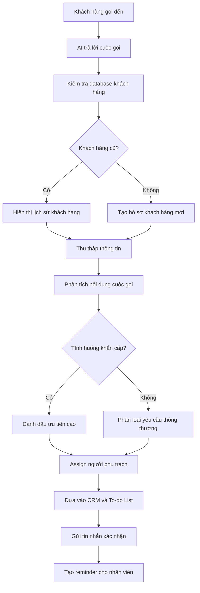

# AI Phone Agent for Roofing Business

## 1. Tổng quan dự án

Dự án xây dựng một **AI Phone Agent** dành cho doanh nghiệp trong lĩnh vực roofing và restoration.

Hệ thống sẽ tiếp nhận cuộc gọi của khách hàng, thu thập thông tin, nhận diện các tình huống khẩn cấp, tóm tắt nội dung cuộc gọi và tự động chuyển công việc đến đúng người phụ trách.

AI Phone Agent đóng vai trò như một lễ tân ảo hoạt động 24/7, giúp doanh nghiệp:

* Giảm số lượng cuộc gọi bị bỏ lỡ
* Thu thập đầy đủ thông tin khách hàng
* Phản hồi khách hàng nhanh hơn
* Tự động phân công công việc
* Theo dõi các cuộc gọi cần xử lý
* Hỗ trợ đặt lịch estimation
* Tích hợp với CRM, Calendar và To-do List

---

## 2. Mục tiêu của hệ thống

Khi khách hàng gọi đến, AI sẽ:

1. Nhận diện khách hàng cũ hoặc khách hàng mới.
2. Trò chuyện và xác định nhu cầu của khách hàng.
3. Thu thập đầy đủ thông tin liên hệ.
4. Ghi lại nội dung cuộc gọi.
5. Chuyển lời nói thành văn bản.
6. Tóm tắt vấn đề của khách hàng.
7. Xác định mức độ khẩn cấp.
8. Tạo nhiệm vụ cho người phụ trách.
9. Đồng bộ dữ liệu với CRM và Calendar.
10. Gửi tin nhắn xác nhận cho khách hàng.
11. Nhắc nhân viên liên hệ lại nếu công việc chưa được xử lý.

---

## 3. Quy trình xử lý cuộc gọi



---

## 4. Nhận diện khách hàng

Khi có cuộc gọi đến, hệ thống sẽ kiểm tra số điện thoại trong database.

### Khách hàng cũ

Nếu số điện thoại đã tồn tại, AI có thể truy xuất:

* Họ tên khách hàng
* Địa chỉ
* Email
* Lịch sử cuộc gọi
* Dự án trước đây
* Insurance claim trước đây
* Người phụ trách
* Các nhiệm vụ chưa hoàn thành
* Các cuộc hẹn đã đặt

### Khách hàng mới

Nếu số điện thoại chưa tồn tại, hệ thống sẽ tạo một hồ sơ khách hàng mới và bắt đầu thu thập thông tin.

---

## 5. Thông tin AI cần thu thập

Trong cuộc gọi, AI cần hỏi và ghi nhận các thông tin sau:

### Thông tin liên hệ

* Họ và tên đầy đủ
* Số điện thoại
* Địa chỉ email
* Địa chỉ căn nhà hoặc địa điểm cần hỗ trợ

### Thông tin vấn đề

* Loại vấn đề khách hàng đang gặp
* Mô tả chi tiết vấn đề
* Thời điểm vấn đề bắt đầu
* Mức độ ảnh hưởng hiện tại
* Thiệt hại có đang tiếp tục xảy ra hay không

### Thời gian liên hệ

* Thời gian khách hàng thuận tiện
* Ngày khách hàng có thể gặp
* Khung giờ mong muốn
* Phương thức liên hệ ưu tiên

### Hình ảnh và tài liệu

AI có thể gửi SMS hoặc email để khách hàng cung cấp:

* Hình ảnh mái nhà
* Hình ảnh khu vực bị rò rỉ
* Hình ảnh thiệt hại do bão
* Video hiện trạng
* Insurance documents
* Claim number
* Thông tin insurance adjuster

---

## 6. Nhận diện tình huống khẩn cấp

AI cần phát hiện các từ khóa hoặc tình huống có mức độ khẩn cấp cao.

### Ví dụ tình huống khẩn cấp

* Bể đường ống nước
* Nước đang chảy vào nhà
* Mái nhà đang bị dột
* Nhà bị ngập nước
* Thiệt hại sau bão
* Cây đổ vào mái nhà
* Cháy nhà
* Hư hỏng liên quan đến điện
* Trần nhà có nguy cơ sập
* Nước đang tiếp tục làm hư hỏng tài sản

## 7. Tích hợp Calendar

Hệ thống sẽ kết nối với Calendar để:

* Kiểm tra lịch trống
* Hiển thị availability của nhân viên
* Đề xuất thời gian estimation
* Tạo lịch hẹn
* Gửi reminder
* Tránh trùng lịch
* Giới hạn số lượng estimation mỗi ngày

### Giới hạn estimation

Hiện tại, doanh nghiệp có thể xử lý khoảng:

```text
3–5 estimation appointments per day
```

Hệ thống cần kiểm tra giới hạn trước khi đặt thêm lịch.

## 8. Quy trình đặt lịch hẹn

### Cuộc gọi đầu tiên

Trong cuộc gọi đầu tiên, AI chủ yếu tập trung vào:

* Thu thập thông tin
* Hiểu vấn đề
* Xác định mức độ khẩn cấp
* Xác nhận địa chỉ
* Thu thập availability
* Yêu cầu khách hàng gửi hình ảnh
* Chuyển thông tin cho nhân viên phụ trách

AI không nhất thiết phải đặt appointment ngay trong cuộc gọi đầu tiên.

### Cuộc gọi hoặc lần liên hệ thứ hai

Sau khi nhân viên kiểm tra thông tin, hệ thống có thể:

* Gọi lại cho khách hàng
* Gửi SMS
* Gửi email
* Đề xuất lịch hẹn
* Xác nhận appointment
* Cập nhật Calendar
* Cập nhật CRM

## 9. To-do List và Reminder

Sau mỗi cuộc gọi, hệ thống sẽ tự động tạo nhiệm vụ.

### Ví dụ nhiệm vụ

```text
Task: Call customer regarding roof leak
Customer: Nguyen Van A
Priority: High
Assigned to: Project Coordinator
Due date: Today
Status: Open
```

### Reminder tự động

Nếu khách hàng đã gọi nhưng chưa được liên hệ lại, hệ thống sẽ:

* Nhắc người phụ trách
* Gửi thông báo trên Dashboard
* Gửi email hoặc SMS nội bộ
* Escalate cho quản lý nếu quá hạn
* Chuyển task sang trạng thái `Overdue`

### Ví dụ

Nếu khách hàng gọi ngày hôm qua nhưng chưa được xử lý:

```text
Reminder: Customer has been waiting for follow-up since yesterday.
```
---

## 10. Tin nhắn xác nhận sau cuộc gọi

Sau cuộc gọi, AI sẽ gửi SMS hoặc email để tóm tắt thông tin.

### Mẫu SMS

```text
Cảm ơn anh/chị đã liên hệ với chúng tôi.

Thông tin chúng tôi đã ghi nhận:

- Họ tên: Nguyen Van A
- Địa chỉ: 123 Main Street
- Vấn đề: Mái nhà bị rò rỉ nước
- Thời gian thuận tiện: Sáng mai

Đội ngũ của chúng tôi sẽ xem xét thông tin và liên hệ lại sớm nhất có thể.

Anh/chị có thể gửi hình ảnh hoặc video về tình trạng hiện tại bằng cách trả lời tin nhắn này.

Website: [Company Website]
```

### Nội dung xác nhận cần bao gồm

* Tên khách hàng
* Số điện thoại
* Địa chỉ dự án
* Vấn đề cần hỗ trợ
* Mức độ ưu tiên
* Availability
* Hướng dẫn gửi hình ảnh
* Các bước tiếp theo
* Website công ty
* Thời gian dự kiến liên hệ lại
---

## 11. Yêu cầu chức năng

### Must Have

* [ ] AI nhận và trả lời cuộc gọi
* [ ] Nhận diện tiếng Anh và tiếng Việt
* [ ] Chuyển giọng nói thành văn bản
* [ ] Thu thập thông tin khách hàng
* [ ] Phát hiện tình huống khẩn cấp
* [ ] Tóm tắt cuộc gọi
* [ ] Tạo hồ sơ khách hàng
* [ ] Assign người phụ trách
* [ ] Tạo task
* [ ] Tạo reminder
* [ ] Gửi SMS xác nhận
* [ ] Tích hợp CRM
* [ ] Tích hợp Calendar
* [ ] Hiển thị dữ liệu trên Dashboard

### Nice to Have

* [ ] Khách hàng gửi hình ảnh qua SMS
* [ ] AI phân tích hình ảnh thiệt hại
* [ ] AI đặt lịch tự động
* [ ] Tối ưu lịch theo vị trí địa lý
* [ ] Google Review automation
* [ ] Marketing follow-up
* [ ] Customer sentiment analysis
* [ ] Insurance document extraction
* [ ] Tự động gọi lại khách hàng
* [ ] Báo cáo hiệu suất nhân viên
---

## 12. Kết quả mong muốn

Hệ thống cuối cùng sẽ hoạt động như một lễ tân AI thông minh có khả năng:

* Tiếp nhận cuộc gọi 24/7
* Không bỏ lỡ khách hàng tiềm năng
* Hiểu nhu cầu khách hàng
* Thu thập và tổ chức dữ liệu
* Phát hiện tình huống khẩn cấp
* Tóm tắt nội dung cuộc gọi
* Chuyển công việc đúng người
* Tạo task và reminder
* Đồng bộ CRM và Calendar
* Hỗ trợ đặt lịch

