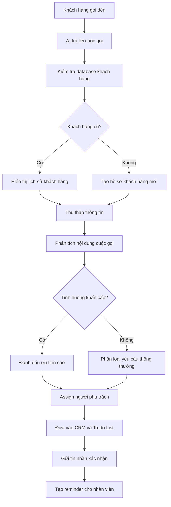

# AI Phone Agent for Roofing Business

## 1. Tổng quan dự án

Dự án xây dựng một **AI Phone Agent** dành cho doanh nghiệp trong lĩnh vực roofing và restoration.

Hệ thống sẽ tiếp nhận cuộc gọi của khách hàng, thu thập thông tin, nhận diện các tình huống khẩn cấp, tóm tắt nội dung cuộc gọi và tự động chuyển công việc đến đúng người phụ trách.

AI Phone Agent đóng vai trò như một lễ tân ảo hoạt động 24/7, giúp doanh nghiệp:

* Giảm số lượng cuộc gọi bị bỏ lỡ
* Thu thập đầy đủ thông tin khách hàng
* Phản hồi khách hàng nhanh hơn
* Tự động phân công công việc
* Theo dõi các cuộc gọi cần xử lý
* Hỗ trợ đặt lịch estimation
* Tích hợp với CRM, Calendar và To-do List

---

## 3. Lĩnh vực hoạt động

Hệ thống được thiết kế ban đầu cho các doanh nghiệp hoạt động trong lĩnh vực:

* Roofing
* Home restoration
* Water damage
* Storm damage
* Fire damage
* Insurance claims
* Property repair services

---

## 4. Mục tiêu của hệ thống

Khi khách hàng gọi đến, AI sẽ:

1. Nhận diện khách hàng cũ hoặc khách hàng mới.
2. Trò chuyện và xác định nhu cầu của khách hàng.
3. Thu thập đầy đủ thông tin liên hệ.
4. Ghi lại nội dung cuộc gọi.
5. Chuyển lời nói thành văn bản.
6. Tóm tắt vấn đề của khách hàng.
7. Xác định mức độ khẩn cấp.
8. Tạo nhiệm vụ cho người phụ trách.
9. Đồng bộ dữ liệu với CRM và Calendar.
10. Gửi tin nhắn xác nhận cho khách hàng.
11. Nhắc nhân viên liên hệ lại nếu công việc chưa được xử lý.

---

## 5. Quy trình xử lý cuộc gọi



---

## 6. Nhận diện khách hàng

Khi có cuộc gọi đến, hệ thống sẽ kiểm tra số điện thoại trong database.

### Khách hàng cũ

Nếu số điện thoại đã tồn tại, AI có thể truy xuất:

* Họ tên khách hàng
* Địa chỉ
* Email
* Lịch sử cuộc gọi
* Dự án trước đây
* Insurance claim trước đây
* Người phụ trách
* Các nhiệm vụ chưa hoàn thành
* Các cuộc hẹn đã đặt

### Khách hàng mới

Nếu số điện thoại chưa tồn tại, hệ thống sẽ tạo một hồ sơ khách hàng mới và bắt đầu thu thập thông tin.

---

## 7. Thông tin AI cần thu thập

Trong cuộc gọi, AI cần hỏi và ghi nhận các thông tin sau:

### Thông tin liên hệ

* Họ và tên đầy đủ
* Số điện thoại
* Địa chỉ email
* Địa chỉ căn nhà hoặc địa điểm cần hỗ trợ

### Thông tin vấn đề

* Loại vấn đề khách hàng đang gặp
* Mô tả chi tiết vấn đề
* Thời điểm vấn đề bắt đầu
* Mức độ ảnh hưởng hiện tại
* Thiệt hại có đang tiếp tục xảy ra hay không

### Thời gian liên hệ

* Thời gian khách hàng thuận tiện
* Ngày khách hàng có thể gặp
* Khung giờ mong muốn
* Phương thức liên hệ ưu tiên

### Hình ảnh và tài liệu

AI có thể gửi SMS hoặc email để khách hàng cung cấp:

* Hình ảnh mái nhà
* Hình ảnh khu vực bị rò rỉ
* Hình ảnh thiệt hại do bão
* Video hiện trạng
---

## 8. Nhận diện tình huống khẩn cấp

AI cần phát hiện các từ khóa hoặc tình huống có mức độ khẩn cấp cao.

### Ví dụ tình huống khẩn cấp

* Bể đường ống nước
* Nước đang chảy vào nhà
* Mái nhà đang bị dột
* Nhà bị ngập nước
* Thiệt hại sau bão
* Cây đổ vào mái nhà
* Cháy nhà
* Hư hỏng liên quan đến điện
* Trần nhà có nguy cơ sập
* Nước đang tiếp tục làm hư hỏng tài sản
---

## 9. Tích hợp HousePro hoặc CRM

Toàn bộ thông tin cuộc gọi cần được đồng bộ với HousePro hoặc CRM đang sử dụng.

### Dữ liệu được gửi vào CRM

```json
{
  "customer_name": "Nguyen Van A",
  "phone": "832-660-9555",
  "email": "customer@example.com",
  "property_address": "Houston, Texas",
  "service_type": "Roof Leak",
  "issue_description": "Water is leaking through the ceiling.",
  "urgency": "High",
  "preferred_contact_time": "Tomorrow morning",
  "assigned_to": "Project Coordinator",
  "call_status": "Follow-up Required"
}
```
---

## 10. Tin nhắn xác nhận sau cuộc gọi

Sau cuộc gọi, AI sẽ gửi SMS hoặc email để tóm tắt thông tin.

### Mẫu SMS

```text
Cảm ơn anh/chị đã liên hệ với chúng tôi.

Thông tin chúng tôi đã ghi nhận:

- Họ tên: Nguyen Van A
- Địa chỉ: 123 Main Street
- Vấn đề: Mái nhà bị rò rỉ nước
- Thời gian thuận tiện: Sáng mai

Đội ngũ của chúng tôi sẽ xem xét thông tin và liên hệ lại sớm nhất có thể.

Anh/chị có thể gửi hình ảnh hoặc video về tình trạng hiện tại bằng cách trả lời tin nhắn này.

Website: [Company Website]
```

### Nội dung xác nhận cần bao gồm

* Tên khách hàng
* Số điện thoại
* Địa chỉ dự án
* Vấn đề cần hỗ trợ
* Mức độ ưu tiên
* Availability
* Hướng dẫn gửi hình ảnh
* Các bước tiếp theo
* Website công ty
* Thời gian dự kiến liên hệ lại

---

## 11. Yêu cầu chức năng

### Must Have

* [ ] AI nhận và trả lời cuộc gọi
* [ ] Nhận diện tiếng Anh và tiếng Việt
* [ ] Chuyển giọng nói thành văn bản
* [ ] Thu thập thông tin khách hàng
* [ ] Phát hiện tình huống khẩn cấp
* [ ] Tóm tắt cuộc gọi
* [ ] Tạo hồ sơ khách hàng
* [ ] Assign người phụ trách
* [ ] Tạo task
* [ ] Tạo reminder
* [ ] Gửi SMS xác nhận
* [ ] Tích hợp CRM
* [ ] Tích hợp Calendar
* [ ] Hiển thị dữ liệu trên Dashboard

### Nice to Have

* [ ] Khách hàng gửi hình ảnh qua SMS
* [ ] AI phân tích hình ảnh thiệt hại
* [ ] AI đặt lịch tự động
* [ ] Tối ưu lịch theo vị trí địa lý
* [ ] Google Review automation
* [ ] Marketing follow-up
* [ ] Customer sentiment analysis
* [ ] Insurance document extraction
* [ ] Tự động gọi lại khách hàng
* [ ] Báo cáo hiệu suất nhân viên


